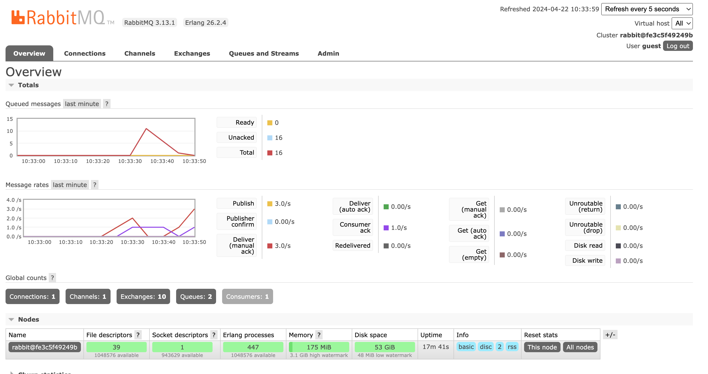

### Reflection Tutorial 8
#### Nama: Naufal Ichsan
#### NPM: 2206082013
#### Kelas: A  

1. **what is amqp?**   
AMQP, atau Advanced Message Queuing Protocol, adalah protokol standar terbuka yang digunakan dalam middleware berbasis pesan. Protokol ini memfasilitasi komunikasi yang efisien antara berbagai aplikasi dengan memungkinkan pertukaran pesan. AMQP umumnya digunakan dalam pembangunan sistem pesan, memungkinkan interaksi yang lancar di antara aplikasi-aplikasi tersebut.

2. **what it means? guest:guest@localhost:5672 , what is the first quest, and what is the second guest, and what is localhost:5672 is for?**     
- String ```guest:guest@localhost:5672``` merupakan string koneksi untuk sebuah server AMQP
- ```guest:guest``` merupakan nama user dan password untuk autentikasi pada server. Dalam kasus ini, baik nama user maupun password keduanya adalah "guest". Dalam banyak konfigurasi default broker pesan seperti RabbitMQ, nama user dan default password keduanya adalah "guest". Namun, dalam lingkungan produksi, sangat disarankan untuk mengubah kredensial default ini karena alasan keamanan.
- ```@localhost:5672``` menentukan host dan port. "localhost" mengacu pada mesin lokal, yang berarti bahwa message brocker (RabbitMQ) berjalan di mesin yang sama di mana kode ini dieksekusi. Port 5672 adalah port default yang digunakan oleh RabbitMQ untuk komunikasi AMQP.

#### foto simulasi slow response rabbitmq
     
Penjelasan: Dapat dilihat bahwa queue sampai 10 ketika saya mencoba menjalankan cargo run pada publisher sebanyak 2x sehingga harus mengirim dan menunggu ke 2x5 data subscriber